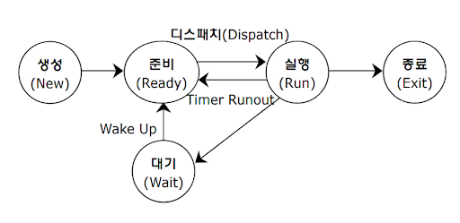
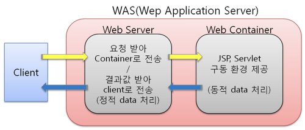
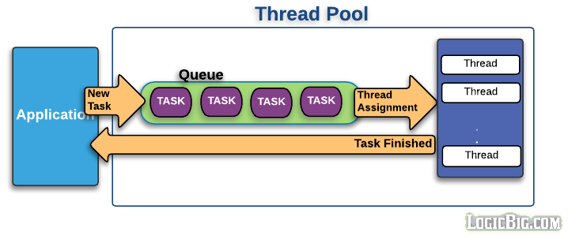

# 프로세스와 쓰레드

프로세스와 쓰레드를 정확히 이해해야 멀티 쓰레드 환경에서 왜 상태값을 갖도록 설계하면 안되는지에 대해 알 수 있다.

특히 `프로세스의 메모리 영역(Stack, Heap, Data, Text)`에 대한 이해가 중요하다.

- 프로세스 메모리 영역
    - `Stack` : 매개변수, 지역변수 등 임시적인 자료
    - `Heap` : 동적으로 할당되는 메모리
    - `Data` : 전역 변수
    - `Text` : Program 의 코드

프로세스는 운영체제에서 여러개가 존재하며 동작한다

## Multi Process

- 두 개 이상의 다수의 프로세서가 협력적으로 하나 이상의 작업을 동시에 처리하는 것이다
- 프로세스는 실행될 때마다 각각에 고유한 메모리 영역을 할당해주어야 하기 때문에 프로세스가 많아질수록 더 많은 메모리 공간을 차지하게 된다

### 장점

- 독립된 구조로 안전성이 높다
- 프로세스 중 하나에 문제가 생겨도 다른 프로세스에 영향을 주지 않는다

### 단점

- 독립된 메모리 영역을 가지고 있기 때문에 `Context Swithching` 을 위한 오버헤드가 발생한다

## Multi Thread

한 프로세스에서 여러 개의 쓰레드를 동시에 수행하는 것이다

멀티 쓰레드를 적용한 어플리케이션의 예시

- 웹 서버 프로세스는 클라이언트 요청이 들어오면 그 요청을 처리하기 위한 별도의 쓰레드를 생성한다
- 워드 프로세서는 사용자의 키 입력에 응답하기 위한 쓰레드, 백그라운드에서 맞춤법 및 문법 검사를 수행하기 위한 쓰레드를 가질 수 있다

### 장점

- 응답성이 좋아진다. 단일 쓰레드를 사용하면 그 작업이 완료될 때 까지 응답을 기다려야 한다. 멀티 쓰레드를 사용함으로서 응답성을 향상시킬 수 있다
- 자원을 공유할 수 있다. 쓰레드는 기본적으로 자신이 속한 프로세스의 자원을 공유하기 때문에 동일한 주소 공간 내에서 여러 쓰레드를 가질 수 있다

### 단점

- 쓰레드는 프로세스 내 자원을 공유하기 때문에 쓰레드 하나에서 오류가 발생하면 같은 프로세스 내의 모든 쓰레드가 종료될 수 있다
- 공유 자원에 대한 동기화 문제를 고려해야 한다

## Context Switching

`Context Switching` 은 하나의 프로세스가 CPU를 사용중인 상태에서 다른 프로세스가 CPU를 사용 하기 위해, 이전의 프로세스의 상태를 보관하고 새로운 프로세스의 상태를 적재하는 작업을 말한다

한 프로세스의 문맥은 그 프로세스의 `PCB(프로세스 제어 블록)` 에 기록되어 있다

프로세스가 증가하게 되면 문맥 교환이 많아져서 오버헤드가 증가하므로 시스템 성능에 악영향을 끼칠 수 있다.

`오버헤드` 란 CPU가 메모리에 적재하는 동안 아무것도 안하게 되는 현상을 의미한다

### 오버헤드의 해결 방안

- 문맥 교환이 자주 발생하지 않도록 다중 프로그래밍의 정도를 낮춘다
- 쓰레드를 이용하여 문맥 교환 부하를 최소화 시킨다

따라서, 이러한 멀티 프로세스의 단점 때문에 `멀티 쓰레드 환경` 을 선호하는 것이다

## PCB

특정 프로세스에 대한 정보를 담고 있는 운영체제의 자료구조이다. 작업을 진행하다가 프로세스의 전환이 발생하면 하던 일을 저장하고 CPU를 반환해야 한다. 그리고 나중에 스케줄링에 의해 재실행되었을 때 이전의 작업
정보를 알아야 한다. 그 정보가 담긴 공간이 `PCB` 이다. 프로세스의 생성과 동시에 그 프로세스의 고유한 `PCB` 도 같이 생성된다.

### 프로세스 제어 블록에 저장되는 정보

- 프로세스 식별자(PID)
- 프로세스 상태
    - new, ready, running, waiting, terminated
- 프로그램 카운터
    - 프로세스가 다음에 실행할 명령어의 주소를 가리킴
- CPU 레지스터
- CPU 스케줄링 정보
    - 프로세스 우선순위, 최종 실행 시각, CPU 점유시간 등
- 메모리 관리 정보
- 계정 정보
- 입출력 상태 정보

## 프로세스 상태 전이

프로세스 상태전이는 프로세스가 시스템 내에 존재하는 동안 프로세스의 상태가 변하는 것을 의미한다.

### 프로세스 상태

- 생성(Create)
    - 사용자에 의해 프로세스가 생성된 상태
- 준비(Ready)
    - CPU를 할당받을 수 있는 상태
- 실행(Running)
    - 프로세스가 CPU를 할당받아 동작중인 상태
- 대기(Waiting)
    - 프로세스 실행 중 입출력 처리 등으로 인해 CPU를 양도하고 입출력 처리가 완료되기 까지 대기 리스트에서 기다리는 상태
- 완료(Complete)
    - 프로세스가 CPU를 할당받아 수행을 종료한 상태

### 프로세스 상태 전이



#### new -> ready

new 상태에서 프로세스가 생성되면 OS 커널에 존재하는 Ready Queue 에 올라가게 된다

#### Dispatch (준비 -> 실행)

프로세스 스케줄러에 의해 결정된 우선순위에 따라 프로세스가 CPU를 점유하게 되는 상태

#### Timeout (실행 -> 준비)

프로세스가 실행중이다가 제한된 시간을 다 소비하여 CPU 점유를 빼앗기는 상태

#### Wakeup (대기 -> 준비)

프로세스가 자원을 할당받는 상태

## Interrupt

인터럽트란 CPU가 특정 기능을 수행하는 도중 급하게 다른 일을 처리하고자 할 때 사용할 수 있는 기능이다

### 인터럽트 과정

1. 프로세스 A 가 실행중 -> 갑자기 저장을 위한 로직이 실행
2. 현재 CPU가 처리하고 있던 일의 진행상황을 저장한다
3. 인터럽트 코드의 실행을 위해 CPU에 기존에 할당되어 있던 작업과 인터럽트 처리 될 작업을 교환한다
4. CPU에서 교환된 인터럽트 코드의 처리를 마친다
5. 이전 작업을 CPU에 다시 할당한다
6. 이전에 중단되었던 곳부터 다시 진행한다

3번에 해당하는 과정이 `Context Swiching` 이다.

## WAS

### Web Server

웹 서버는 클라이언트로부터 HTTP 요청을 받아 HTML 문서나 각종 리소스를 응답하는 서버

```
Client -------------> Server
          HTTP 요청
          
          
      <-------------- 
          HTTP 응답
```

그렇다면 동적인 컨텐츠를 어떻게 제공할 수 있을까?

### WAS

- Web Application Server의 약자
- 웹 애플리케이션과 서버 환경을 만들어 동작시키는 기능을 제공하는 소프트웨어 프레임워크
    - Web Server + Web Container
- HTML 같은 정적인 페이지에서 처리할 수 없는 비즈니스 로직이나 동적인 컨텐츠를 제공



### Web Server vs WAS

정적인 컨텐츠 vs 정적+동적인 컨텐츠

## ThreadPool

### ThreadPool을 사용하는 이유

프로세스에서 병렬 작업처리가 많아지면 쓰레드 개수가 증가하고 그에 따른 쓰레드 생성과 스케줄링으로 인해 CPU 사용량이 증가하여 메모리 사용량이 늘어난다. 따라서 시스템 성능이 저하되고, 갑작스러운 병렬 작업의
폭증에 따른 쓰레드 폭증을 막으려면 `ThreadPool` 을 사용해야 한다.

쉽게 설명하자면 쓰레드를 미리 만들어 놓은 풀장?이라고 생각하면 된다. 만약 전쟁이 일어나서 100명의 인력이 필요하다고 한다면, 그때 그때 인력을 투입하는것보다 미리 100명을 준비 시키는게 대응이 더 빠르다.

### ThreadPool의 동작 원리

우리가 만든 어플리케이션에서 사용자로부터 들어온 요청을 작업 큐에 넣고, `ThreadPool` 은 작업 큐에 들어온 `Task` 일감을 미리 생성해놓은 `Thread` 에게 일감을 할당한다. 일을 다
처리한 `Thread` 은 다시 어플리케이션에게 결과를 전달한다.



### ThreadPool의 장점

- 프로그램 성능 저하 방지를 위해
    - 매번 발생되는 작업을 병렬 처리하기 위해 `Thread` 을 생성/수거 하는데 따른 부담은 프로그램 전체적인 퍼포먼스를 저하시킨다. 그래서 미리 `ThreadPool` 을 만들어 놓는다
- 다수의 사용자 요청을 처리하기 위해
    - 다수의 사용자 요청을 수용하고, 빠르게 처리하고 대응하기 위해 `ThreadPool` 을 사용한다

### ThreadPool의 단점

- 과유불급
    - 많은 병렬 처리를 예상해서 1억개의 `Thread` 을 만들었다고 가정했을 때, 실제로 100개만 사용한다면 나머지 `Thread` 은 아무일도 하지 않고 메모리만 차지하는 경우가 발생할 수 있다

## 동시성 이슈란?

`Thread` 은 CPU 작업의 한 단위이다. 여기서 멀티 쓰레드 방식은 멀티 테스킹을 하는 방식 중, 한 코어에서 여러 쓰레드를 이용해서 작업을 처리하는 방식이다. 멀티 쓰레드를 이용하면 공유하는 자원이 멀티
프로세스 방식보다 `Context Switching` 오버헤드가 적어, 메모리 리소스가 상대적으로 적다는 장점이 있다. 하지만 자원을 공유하는 단점도 존재한다.

여러 `Thread` 가 하나의 자원을 공유하고 있기 때문에 같은 자원을 두고 `교착상태` 같은 문제가 발생하는 것이다.

## 동시성 이슈를 피하는 방법 (스프링에서)

## Thread Safe 하게 설계하는 방법

## Q&A

- Context Swiching 보관되는 장소, 보관되는 이유

## 출처

https://limkydev.tistory.com/55
https://www.youtube.com/watch?v=QmtYKZC0lMU&t=1121s
https://github.com/NKLCWDT/cs/blob/main/Operating%20System/%ED%94%84%EB%A1%9C%EC%84%B8%EC%8A%A4%EC%99%80%20%EC%93%B0%EB%A0%88%EB%93%9C.md
https://github.com/Seogeurim/CS-study/tree/main/contents/operating-system#%ED%94%84%EB%A1%9C%EC%84%B8%EC%8A%A4%EC%99%80-%EC%8A%A4%EB%A0%88%EB%93%9C

https://velog.io/@dyllis/%EB%8F%99%EC%8B%9C%EC%84%B1%EC%9D%B4-%EB%AC%B4%EC%97%87%EC%9D%BC%EA%B9%8C
https://velog.io/@mooh2jj/%EB%A9%80%ED%8B%B0-%EC%8A%A4%EB%A0%88%EB%93%9C%EC%9D%98-%EB%8F%99%EC%8B%9C%EC%84%B1-%EC%9D%B4%EC%8A%88


